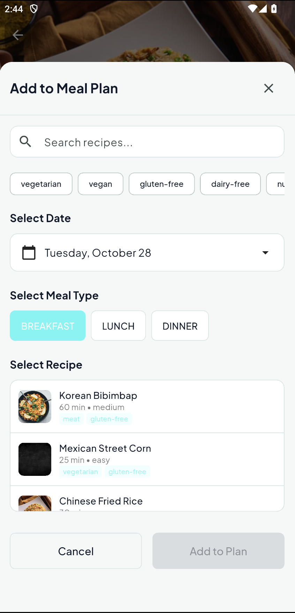
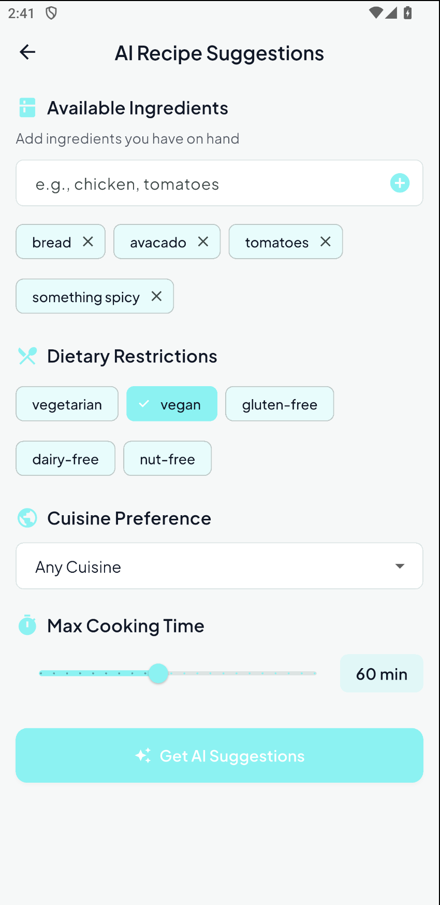
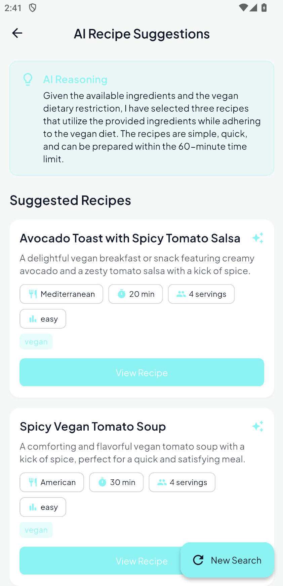
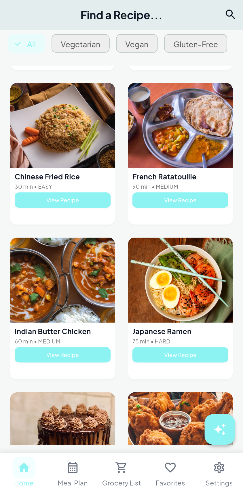
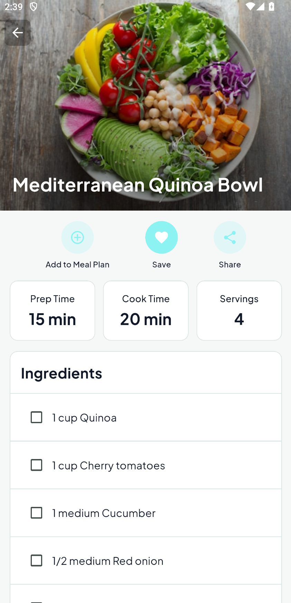
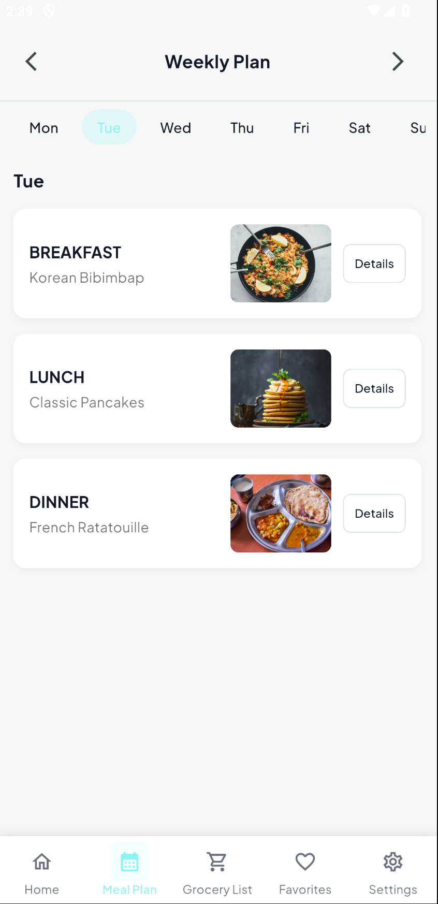
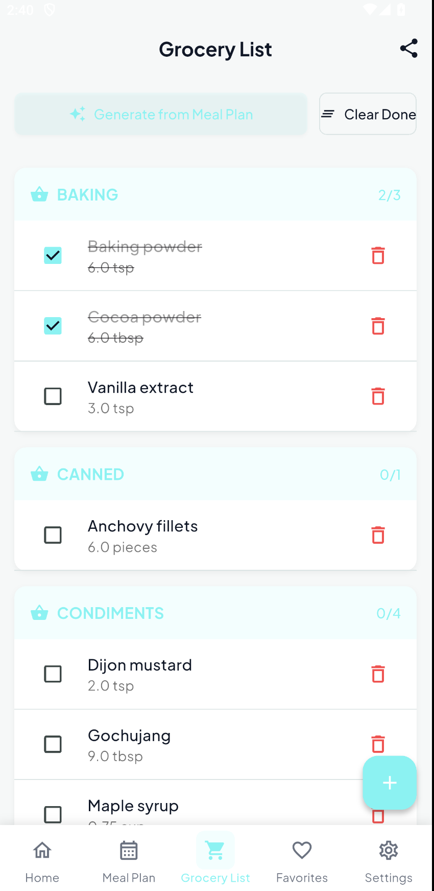

# 🍳 AI Recipe & Meal Planning App (With Dark Mode)

<div align="center">


*A comprehensive Flutter application for recipe management, meal planning, and intelligent grocery list generation*
<p align="center">
  
  
  
</p>

</div>

---

## 📋 Table of Contents

- [👨‍💻 Developer Information](#-developer-information)
- [🎥 Project Presentation](#-project-presentation)
- [🎯 Project Overview](#-project-overview)
- [✨ Key Features](#-key-features)
- [🛠️ Technology Stack](#️-technology-stack)
- [📱 Screenshots](#-screenshots)
- [🚀 Getting Started](#-getting-started)
- [📊 Project Structure](#-project-structure)
- [🤖 AI Integration](#-ai-integration)
- [📈 Features Breakdown](#-features-breakdown)
- [📄 License](#-license)


---

## 👨‍💻 Developer Information

**Developer**: Sanjay Reddy Choudapur  
**Panther ID**: 002900942   

---

## 🎥 Project Presentation

### 📊 Presentation Slides
**[View Project Presentation Slides](https://www.canva.com/design/DAG3C7z9XMY/YnQYKk0VSPQD4uSzRY47AQ/edit?utm_content=DAG3C7z9XMY&utm_campaign=designshare&utm_medium=link2&utm_source=sharebutton)**

### 🎬 YouTube Explanation
**[Watch Project Explanation Video](https://youtu.be/5QMDqu8G-bE)**

---


## 🎯 Project Overview

The **Recipe & Meal Planning App** is a comprehensive mobile application designed to revolutionize how users manage their cooking and meal planning. Built with Flutter, this app combines traditional recipe management with modern AI-powered suggestions to create an intelligent cooking companion.

### 🎯 Problem Statement

- **Fragmented Recipe Management**: Users struggle to organize recipes from multiple sources
- **Meal Planning Complexity**: Planning weekly meals and generating shopping lists is time-consuming
- **Dietary Restriction Management**: Difficulty finding recipes that match specific dietary needs
- **Grocery List Inefficiency**: Manual grocery list creation leads to forgotten items and overspending
- **Limited Recipe Discovery**: Users often cook the same recipes repeatedly due to lack of inspiration

### 💡 Solution

This app provides a unified platform that:
- Centralizes recipe storage with intelligent categorization
- Automates meal planning with visual weekly calendars
- Generates smart grocery lists from planned meals
- Offers AI-powered recipe suggestions based on available ingredients
- Supports comprehensive dietary filtering and preferences


---


## ✨ Key Features

### 🍽️ Recipe Management
- **Comprehensive Recipe Database**: Store recipes with detailed ingredients, instructions, and metadata
- **Smart Categorization**: Automatic categorization by cuisine, difficulty, and dietary tags
- **Advanced Filtering**: Filter by dietary restrictions (Vegetarian, Vegan, Gluten-Free, etc.)
- **Favorites System**: Save and quickly access your favorite recipes
- **Search Functionality**: Powerful search with real-time results

### 📅 Meal Planning
- **Weekly Calendar View**: Visual meal planning with drag-and-drop functionality
- **Multi-Meal Support**: Plan breakfast, lunch, dinner, and snacks
- **Recipe Integration**: Seamlessly add recipes to meal slots
- **Date Navigation**: Easy week-to-week navigation

### 🛒 Smart Grocery Lists
- **Auto-Generation**: Automatically generate grocery lists from planned meals
- **Category Grouping**: Organize items by food categories (Produce, Dairy, Meat, etc.)
- **Smart Quantity Merging**: Combine duplicate ingredients intelligently
- **Check-off Functionality**: Track shopping progress with checkboxes
- **Manual Additions**: Add custom items to your grocery list

### 🤖 AI-Powered Suggestions
- **Ingredient-Based Recommendations**: Get recipe suggestions based on available ingredients
- **Dietary Preference Integration**: AI respects your dietary restrictions
- **Cooking Time Constraints**: Filter suggestions by available cooking time
- **Cuisine Preferences**: Get suggestions matching your preferred cuisine types
- **Intelligent Reasoning**: AI explains why specific recipes were suggested

### 🎨 User Experience
- **Dark/Light Mode**: Beautiful themes for all lighting conditions
- **Responsive Design**: Optimized for phones and tablets
- **Smooth Animations**: Polished transitions and micro-interactions
- **Offline Support**: Full functionality without internet connection
- **Share Functionality**: Share recipes and grocery lists with others

---

## 🛠️ Technology Stack

### Frontend
- **Flutter**: Cross-platform mobile development framework
- **Dart**: Programming language for Flutter development
- **Material Design 3**: Modern UI design system
- **Google Fonts**: Plus Jakarta Sans typography

### Backend & Storage
- **SQLite**: Local database for data persistence
- **sqflite**: Flutter SQLite plugin
- **Provider**: State management solution
- **SharedPreferences**: User preferences storage

### AI Integration
- **OpenRouter API**: AI model access platform
- **Claude 3 Haiku**: Anthropic's efficient AI model
- **HTTP Client**: RESTful API communication

### Additional Libraries
- **cached_network_image**: Image caching and loading
- **share_plus**: Native sharing functionality
- **uuid**: Unique identifier generation
- **intl**: Internationalization and date formatting

---

## 📱 Screenshots

<div align="center">

| Home Screen | Recipe Detail | Meal Planner |
|-------------|---------------|--------------|
|  |  |  |

| Grocery List | AI Ask | AI Suggestions |
|---------------|----------------|----------|
|  |  |  |

</div>

---

## 🚀 Getting Started

### Prerequisites
- Flutter SDK (3.0 or higher)
- Dart SDK (3.0 or higher)
- Android Studio / VS Code
- Android Emulator or Physical Device

### Installation

1. **Clone the repository**
   ```bash
   git clone https://github.com/sannzay/recipe-meal-planner-app.git
   cd recipe-meal-planner-app
   ```

2. **Install dependencies**
   ```bash
   flutter pub get
   ```

3. **Configure AI API Key**
   - Open `lib/config/api_config.dart`
   - Replace `'Your OpenRouter API key here'` with your actual OpenRouter API key
   - Get your API key from [OpenRouter](https://openrouter.ai/keys)

4. **Run the application**
   ```bash
   flutter run
   ```

### First Launch
- The app will automatically seed the database with 22+ sample recipes
- Explore the features using the sample data
- Try the AI suggestions feature with the provided API key

---

## 📊 Project Structure

```
lib/
├── config/                 # API configuration
├── database/              # Database helpers and repositories
│   ├── database_helper.dart
│   ├── recipe_repository.dart
│   ├── meal_plan_repository.dart
│   ├── grocery_repository.dart
│   └── seed_data.dart
├── models/                # Data models
│   ├── recipe_model.dart
│   ├── ingredient_model.dart
│   ├── meal_plan_model.dart
│   ├── grocery_item_model.dart
│   └── ai_models.dart
├── providers/             # State management
│   ├── recipe_provider.dart
│   ├── meal_plan_provider.dart
│   ├── grocery_provider.dart
│   ├── theme_provider.dart
│   └── settings_provider.dart
├── screens/               # UI screens
│   ├── splash_screen.dart
│   ├── main_screen.dart
│   ├── recipe_list_screen.dart
│   ├── recipe_detail_screen.dart
│   ├── meal_planner_screen.dart
│   ├── grocery_list_screen.dart
│   ├── favorites_screen.dart
│   ├── settings_screen.dart
│   ├── search_screen.dart
│   └── ai_suggestion_screen.dart
├── services/              # Business logic services
│   ├── share_service.dart
│   ├── recipe_ai_service.dart
│   ├── openrouter_client.dart
│   ├── error_handling_service.dart
│   └── validation_service.dart
├── utils/                 # Utilities and constants
│   ├── app_theme.dart
│   ├── constants.dart
│   ├── ui_polish_constants.dart
│   └── ui_helpers.dart
├── widgets/               # Reusable widgets
│   ├── recipe_card.dart
│   ├── meal_selection_dialog.dart
│   ├── grocery_category_section.dart
│   ├── empty_state_widget.dart
│   └── ...
└── main.dart              # App entry point
```

---

## 🤖 AI Integration

### OpenRouter Integration
The app integrates with OpenRouter API to provide intelligent recipe suggestions:

- **Model**: Claude 3 Haiku (cost-effective and fast)
- **Features**: 
  - Ingredient-based recipe matching
  - Dietary restriction compliance
  - Cooking time optimization
  - Cuisine preference matching
- **API Key Management**: Secure configuration with budget controls

### AI Workflow
1. User inputs available ingredients
2. Sets dietary preferences and constraints
3. AI analyzes requirements and suggests recipes
4. Provides reasoning for each suggestion
5. User can view full recipe details

---

## 📈 Features Breakdown

### Core Features ✅
- [x] Recipe database with 22+ sample recipes
- [x] Recipe list with grid view and filtering
- [x] Dietary filters (Vegetarian, Vegan, Gluten-Free, etc.)
- [x] Recipe detail view with ingredients and instructions
- [x] Favorites functionality
- [x] Weekly meal planner with visual calendar
- [x] Grocery list with category grouping
- [x] Smart grocery list generation from meal plans
- [x] Share recipe and grocery list functionality
- [x] Local SQLite storage with data persistence
- [x] Dark/Light mode support

### Bonus Features ✅
- [x] AI-powered recipe suggestions with OpenRouter
- [x] Multiple dietary preference support

---

## 📄 License

This project is licensed under the MIT License

---

<div align="center">

### 🌟 Star this repository if you found it helpful!

**Built with ❤️ by Sanjay Reddy**

[](https://github.com/sannzay/recipe-meal-planner-app)
[](https://github.com/sannzay/recipe-meal-planner-app)

</div>
